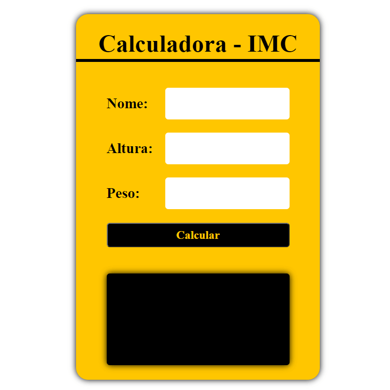
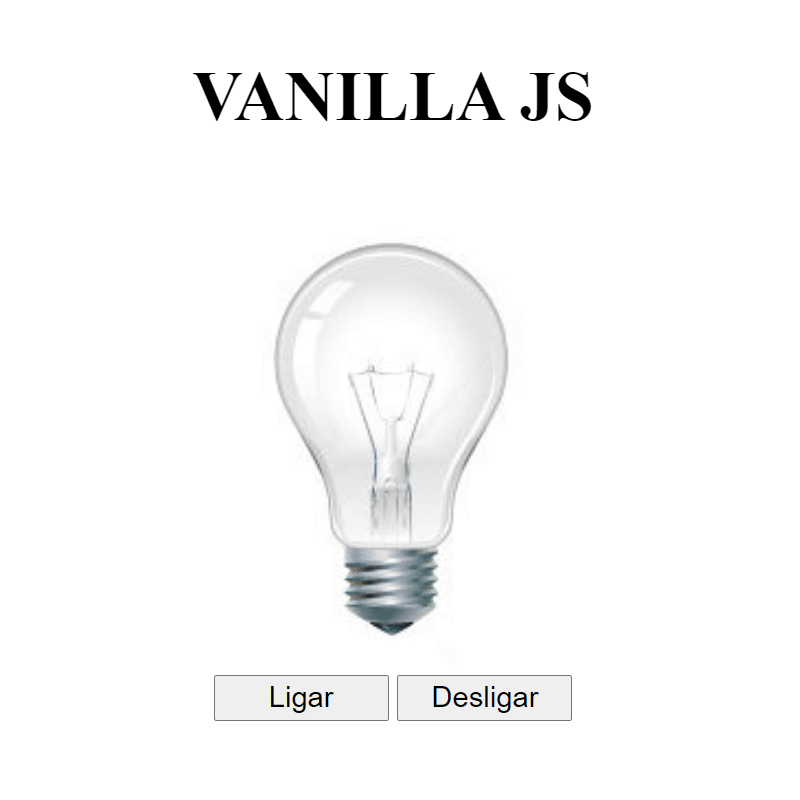
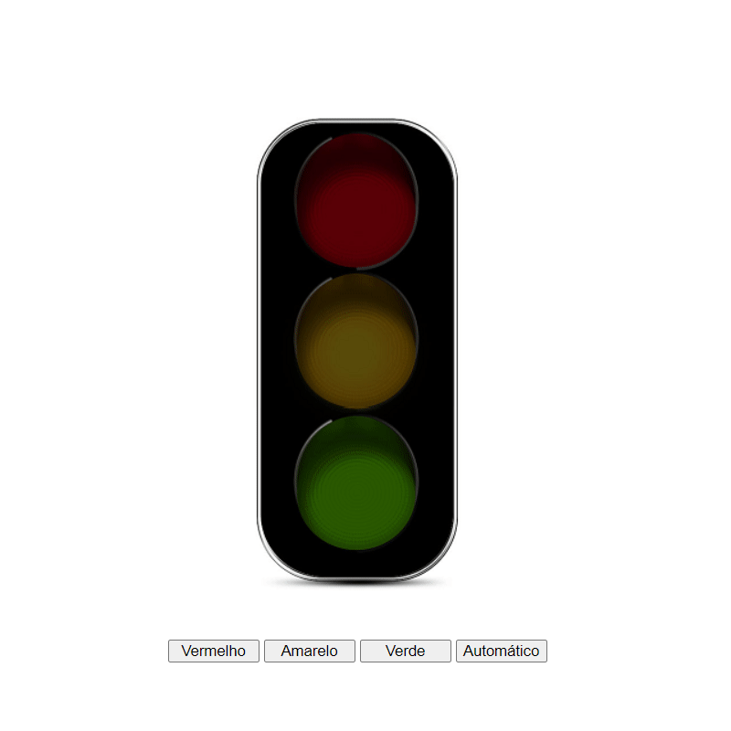
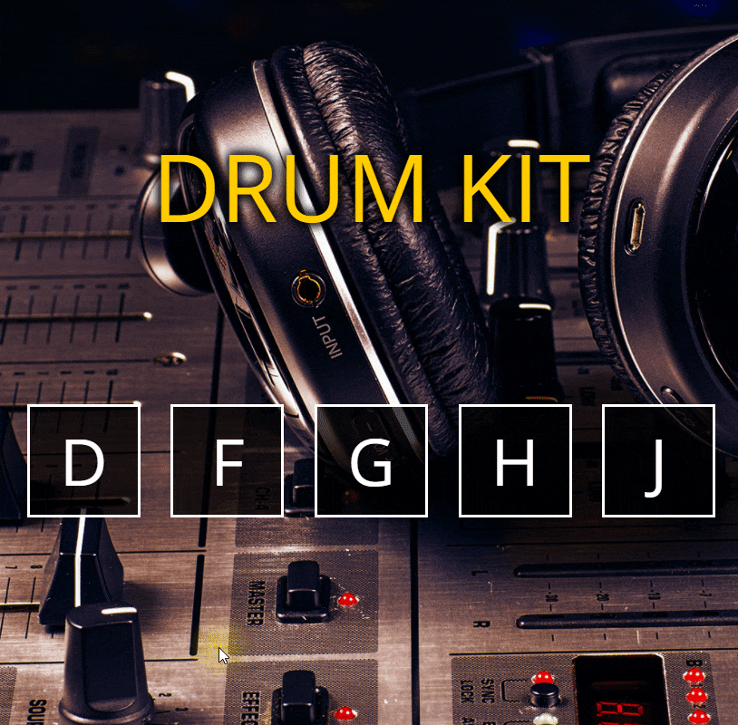
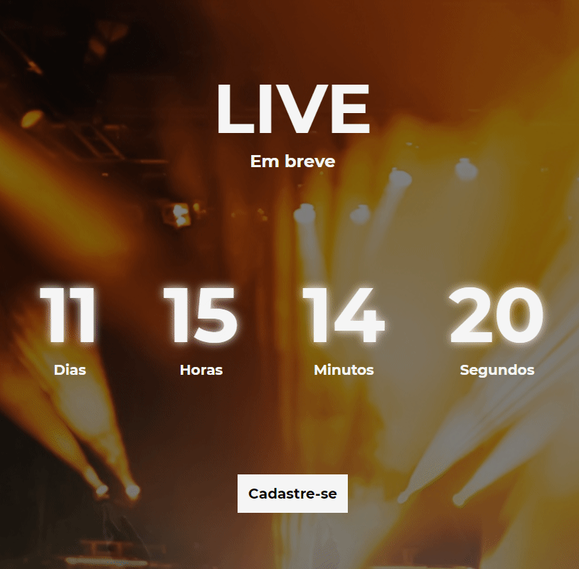
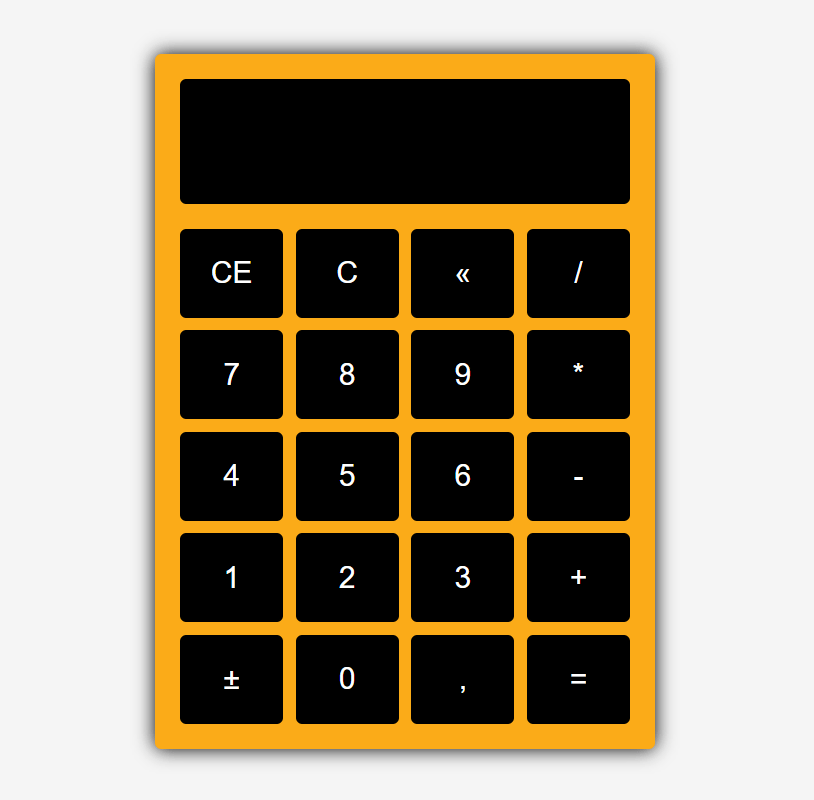
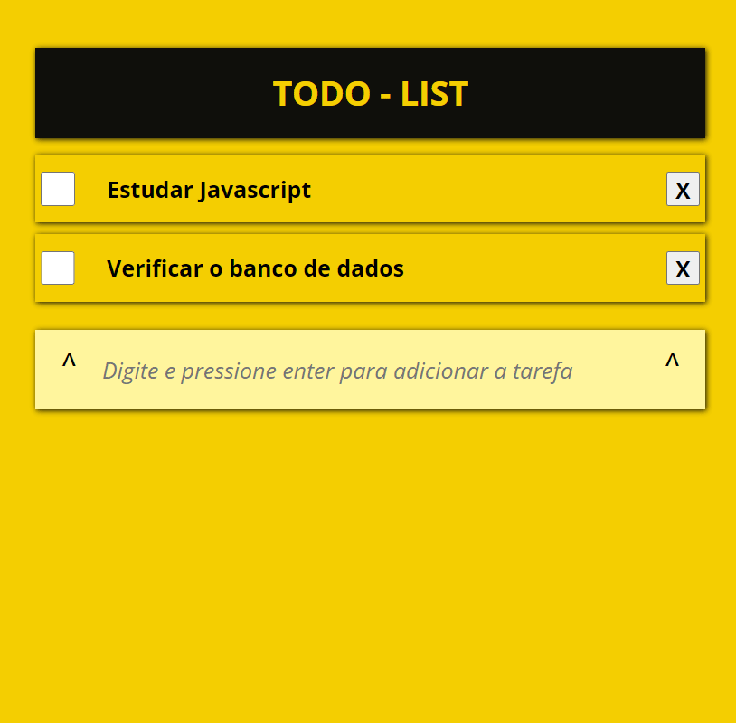
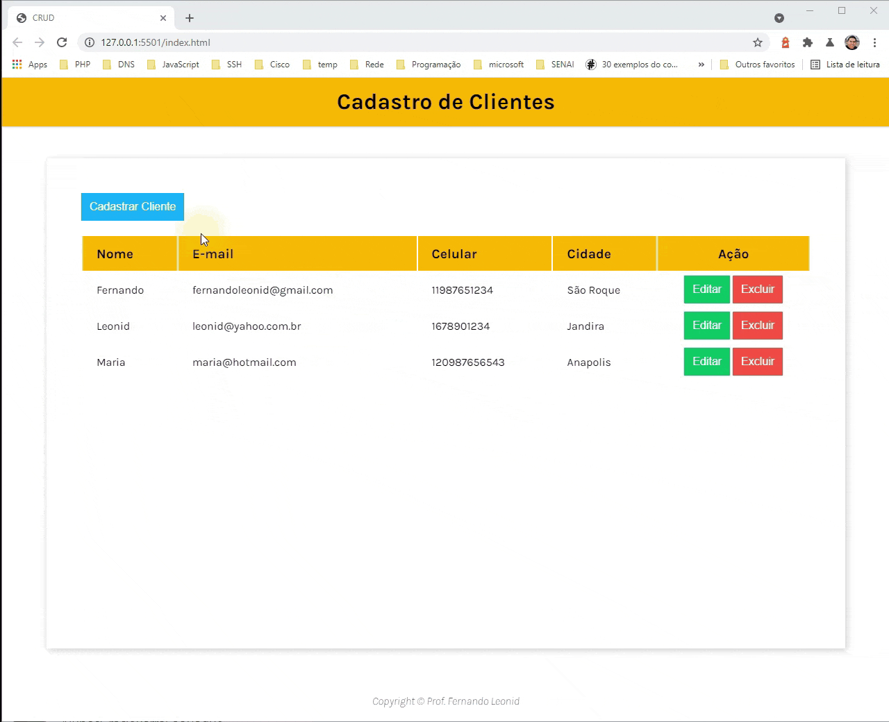

# Mini Projetos com javascript puro

## Objetivo
Não tem outra maneira para se aprender além de **praticar, praticar e praticar**.

Pensando nisso, criei este repositório com objetivo juntar ideias para mini projetos que podem ajudar quem está iniciando no desenvolvimento web utilizando o javascript puro.
Você pode realizar observando o resultado, ou verificando o código, ou ainda acompanhando o desenvolvimento por meio de videos.

Se gostou da ideia acompanhe os projetos abaixo:

<table border="2">
  <tr>
    <td>
        <h3>00 - Calculadora IMC</h3>
        <li><a href="./00-imc/">Código</a></li>
        <li><a href="https://youtu.be/RacwEvoTz_Y">Passo a passo</a></li>
        
    </td>
      <td>
        <h3>01 - Lâmpada</h3>
        <li><a href="./01-lamp/">Código</a></li>
        <li><a href="https://youtu.be/4r0zOW9Zn-Y">Passo a passo</a></li>
        
    </td>
    <td>
      <h3>02 - Semáforo</h3>
      <li><a href="./02-semaforo/">Código</a></li>
      <li><a href="https://youtu.be/EujFSEsZsk4">Passo a passo</a></li>
      
    </td>
  </tr>
  <tr>
    <td>
      <h3>03 - Slide Show</h3>
      <li><a href="./03-slideshow/">Código</a></li>
      <li><a href="https://youtu.be/csNYVAS2ex8">Passo a passo</a></li>
      
    </td>
    <td>
      <h3>04 - Drum-kit</h3>
      <li><a href="./04-DRUM-KIT/">Código</a></li>
      <li><a href="https://youtu.be/2qA8tlJ24uQ">Passo a passo</a></li>
      
    </td>
    <td>
      <h3>05 - CountDown</h3>
      <li><a href="./05-countdown/">Código</a></li>
      <li><a href="https://youtu.be/nmWrwFjiCvo">Passo a passo</a></li>
      
    </td>
  </tr>
  <tr>
    <td>
      <h3>06 - Calculadora</h3>
      <li><a href="./06-Calculadora/">Código</a></li>
      <li><a href="https://youtu.be/oRZQ5EZOrQk">Passo a passo</a></li>
      
    </td>
    <td>
      <h3>07 - To-do-list</h3>
      <li><a href="./07-todo-List/">Código</a></li>
      <li><a href="https://youtu.be/oGEYs52ZuHY">Passo a passo</a></li>
      
    </td>
    <td>
      <h3>08 - CRUD</h3>
      <li><a href="./08-crud/">Código</a></li>
      <li><a href="https://youtu.be/oGEYs52ZuHY">Passo a passo</a></li>
      
    </td>
  </tr>
  
</table>